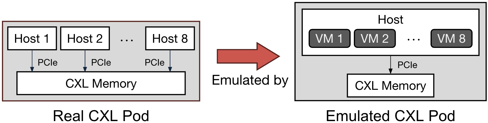

# Tigon
Tigon[^1] is a research distributed transactional in-memory database that synchronizes cross-host concurrent data accesses over shared CXL memory. Tigon adopts the Pasha architecture[^2].
This repository is implemented based on the [lotus](https://github.com/DBOS-project/lotus) codebase from Xinjing Zhou.

This repository contains the following:
* An implementation of Tigon
* Sundial[^3] optimized for a CXL pod: Sundial-CXL and Sundial+
* DS2PL[^4] optimized for a CXL pod: DS2PL-CXL and DS2PL+
* A benchmarking framework that supports full TPC-C with consistency check, YCSB, SmallBank, and TATP (WIP)
* Scripts for emulating a CXL pod on a single physical machine
* Scripts for building and running Tigon/baselines
* Scripts for reproducing the results in the paper

[^1]: Tigon: A Distributed Database for a CXL Pod, *To appear at OSDI '25*
[^2]: Pasha: An Efficient, Scalable Database Architecture for CXL Pods, *CIDR '25*
[^3]: Sundial: Harmonizing Concurrency Control and Caching in a Distributed OLTP Database Management System, *VLDB '18*
[^4]: Lotus: scalable multi-partition transactions on single-threaded partitioned databases, *VLDB '22*

## Claims
By running the experiments, you should be able to reproduce the numbers shown in:
* **Figure 5(a)**: TPC-C throughput of Sundial, Sundial-CXL, and Sundial+, varying percentages of multi-partition transactions
* **Figure 5(b)**: TPC-C throughput of DS2PL, DS2PL-CXL, and DS2PL+, varying percentages of multi-partition transactions
* **Figure 5(c)**: TPC-C throughput of Tigon, Sundial+, DS2PL+, and Motor, varying percentages of multi-partition transactions
* **Figure 6**: YCSB throughput of Tigon, Sundial+, DS2PL+, and Motor, varying both read/write ratios and percentages of multi-partition transactions
* **Figure 7**: Tigon's sensitivity to the size of hardware cache-coherent region
* **Figure 8**: Comparison of different software cache-coherence protocols

## Emulate a CXL Pod using VMs
We emulate a CXL pod by running multiple virtual machines (VMs) on a single host connected to a CXL 1.1 memory module because there are no commercially available (or hardware prototype) CXL devices that support fine-grained memory sharing with hardware cache coherence. Each physical host running on a real CXL pod is emulated by a VM running on a single host. The cache coherence across VMs is maintained by hardware as the CXL 1.1 memory device is cache-coherent to its connected physical machine.



## Important Notes
* If you use one of our pre-configured machines, please skip [Testbed Setup](#Testbed-Setup)
* Since Motor (one of our baselines) requires special hardware (4 machines connected via RDMA), we provide pre-measured raw numbers in ``results/motor``. If you would like to run Motor, please refer to https://github.com/minghust/motor
* Please run all the commands in the project root directory

## Testbed Setup (Skip if using pre-configured machines)

### Hardware Requirements

**Option A**
* A machine with at least 40 cores in one socket
* CXL memory connected to the first socket of the machine
* Ubuntu 22.04

**Option B** (if CXL memory is not available)
* A two-socket machine with at least 40 cores in each socket
* Ubuntu 22.04

### Setup VM-based CXL Pod Emulation from Scratch

1. Clone the repository
```bash
git clone https://github.com/yibo-huang/tigon.git
```

2. Install dependencies and switch the kernel to 5.19
```bash
./scripts/setup.sh DEPS # install dependencies
./scripts/setup.sh HOST # setup host and install kernel 5.19
sudo reboot # reboot to switch to the new kernel
```

3. Build VM image
```bash
./emulation/image/make_vm_img.sh
```

4. Launch VMs
```bash
# if you are using real CXL memory (Option A), run the following:
sudo daxctl reconfigure-device --mode=system-ram dax0.0 --force # manage CXL memory as a CPU-less NUMA node
sudo ./emulation/start_vms.sh --using-old-img --cxl 0 5 8 0 2 # replace the last argument with the NUMA node number of CXL memory (e.g., 2)

# if you emulate CXL memory using remote NUMA node (Option B), run the following:
sudo ./emulation/start_vms.sh --using-old-img --cxl 0 5 8 1 1 # launch 8 VMs each with 5 cores
```

5. Setup VMs
```bash
./scripts/setup.sh VMS 8 # 8 is the number of VMs
```

## Compile Tigon and Send the Binary to VMs
```bash
./scripts/run.sh COMPILE_SYNC 8 # 8 is the number of VMs
```

## Hello-World Example for Kick-the-tires Deadline
The command below runs Tigon with TPC-C as the workload.
```bash
# example command to run TPC-C
./scripts/run.sh TPCC TwoPLPasha 8 3 mixed 10 15 1 0 1 Clock OnDemand 200000000 1 WriteThrough None 15 5 GROUP_WAL 20000 0 0
```

You can expect the last few lines of output to look something like this (numbers may differ):
```bash
I0426 06:22:58.143128 204381 Coordinator.h:610] Global Stats: total_commit: 360162 total_size_index_usage: 11890568 total_size_metadata_usage: 2463208 total_size_data_usage: 168300112 total_size_transport_usage: 134218176 total_size_misc_usage: 352 total_hw_cc_usage: 14354128 total_usage: 316872416
I0426 06:22:59.143204 204415 Dispatcher.h:154] Incoming Dispatcher exits, network size: 5967050. socket_message_recv_latency(50th) 1 socket_message_recv_latency(75th) 2 socket_message_recv_latency(95th) 2 socket_message_recv_latency(99th) 4 internal_message_recv_latency(50th) 0 socket_message_recv_cnt 4141 socket_read_syscall 47768196 internal_message_recv_cnt 0
I0426 06:22:59.143455 204381 WALLogger.h:539] Group Commit Stats: 45391 us (50%) 62229 us (75%) 91695 us (95%) 111490 us (99%) 47239 us (avg) committed_txn_cnt 620218
I0426 06:22:59.146075 204381 WALLogger.h:545] Queuing Stats: 22565 us (50%) 39183 us (75%) 57647 us (95%) 72655 us (99%) 25590 us (avg)
I0426 06:22:59.146092 204381 WALLogger.h:550] Disk Sync Stats: 1717 us (50%) 2071 us (75%) 4620 us (95%) 7078 us (99%) 2040 us (avg) disk_sync_cnt 5098 disk_sync_size 1543621646 current global epoch 2226
I0426 06:22:59.206394 204381 Coordinator.h:155] round_trip_latency 58 (50th) 60 (75th) 71 (95th) 71 (99th) 
I0426 06:22:59.206580 204381 Coordinator.h:407] Coordinator exits.
I0426 06:22:59.981012 204381 Database.h:736] TPC-C consistency check passed!
killing previous experiments...
```

## Reproduce the Results with an All-in-one Script (~5 hours)

We provide an all-in-one script for your convenience, which runs all the experiments and generates all the figures. The figures are stored in ``results/test1``. If you would like to run it multiple times, please use different directory names under ``results`` to avoid overwriting old results (e.g., ``results/test2``).
```bash
./scripts/push_button.sh results/test1 # use a different directory name under results each time to avoid overwriting old results
```

To inteprete the results:
* Figure 5 (a): ``results/tpcc/tpcc-sundial.pdf``
* Figure 5 (b): ``results/tpcc/tpcc-twopl.pdf``
* Figure 5 (c): ``results/tpcc/tpcc.pdf``
* Figure 6: ``results/ycsb/ycsb.pdf``
* Figure 7: ``results/hwcc_budget/hwcc_budget.pdf``
* Figure 8: ``results/swcc/swcc.pdf``

## Reproduce the Results One by One
### Reproduce Figure 5

```bash
./scripts/run_tpcc.sh ./results/test1 # run experiments
./scripts/parse/parse_tpcc.sh ./results/test1 # parse results
./scripts/plot/plot_tpcc_sundial.py ./results/test1 # generate Figure 5(a)
./scripts/plot/plot_tpcc_twopl.py ./results/test1 # generate Figure 5(b)
./scripts/plot/plot_tpcc.py ./results/test1 # generate Figure 5(c)
```
To inteprete the results:
* Figure 5 (a): ``results/tpcc/tpcc-sundial.pdf``
* Figure 5 (b): ``results/tpcc/tpcc-twopl.pdf``
* Figure 5 (c): ``results/tpcc/tpcc.pdf``

### Reproduce Figure 6

```bash
./scripts/run_ycsb.sh ./results/test1 # run experiments
./scripts/parse/parse_ycsb.py ./results/test1 # parse results
./scripts/plot/plot_ycsb.py ./results/test1 # generate Figure 6
```
The result pdf is ``results/ycsb/ycsb.pdf``

### Reproduce Figure 7

```bash
./scripts/run_hwcc_budget.sh ./results/test1 # run experiments
./scripts/parse/parse_hwcc_budget.py ./results/test1 # parse results
./scripts/plot/plot_hwcc_budget.py ./results/test1 # generate Figure 7
```
The result pdf is ``results/hwcc_budget/hwcc_budget.pdf``

### Reproduce Figure 8

```bash
./scripts/run_swcc.sh ./results/test1 # run experiments
./scripts/parse/parse_swcc.py ./results/test1 # parse results
./scripts/plot/plot_swcc.py ./results/test1 # generate Figure 8
```
The result pdf is ``results/swcc/swcc.pdf``

## Test Tigon in Various Configurations

Tigon is highly-configurable. Here we explain how to use ``scripts/run.sh`` to test Tigon in various configurations.

```bash
# run TPCC experiments
./scripts/run.sh TPCC SYSTEM HOST_NUM WORKER_NUM QUERY_TYPE REMOTE_NEWORDER_PERC REMOTE_PAYMENT_PERC USE_CXL_TRANS USE_OUTPUT_THREAD ENABLE_MIGRATION_OPTIMIZATION MIGRATION_POLICY WHEN_TO_MOVE_OUT HW_CC_BUDGET ENABLE_SCC SCC_MECH PRE_MIGRATE TIME_TO_RUN TIME_TO_WARMUP LOGGING_TYPE EPOCH_LEN MODEL_CXL_SEARCH GATHER_OUTPUTS

# example command to run TPC-C
./scripts/run.sh TPCC TwoPLPasha 8 3 mixed 10 15 1 0 1 Clock OnDemand 200000000 1 WriteThrough None 30 10 BLACKHOLE 20000 0 0

# run YCSB experiments
./scripts/run.sh YCSB SYSTEM HOST_NUM WORKER_NUM QUERY_TYPE KEYS RW_RATIO ZIPF_THETA CROSS_RATIO USE_CXL_TRANS USE_OUTPUT_THREAD ENABLE_MIGRATION_OPTIMIZATION MIGRATION_POLICY WHEN_TO_MOVE_OUT HW_CC_BUDGET ENABLE_SCC SCC_MECH PRE_MIGRATE TIME_TO_RUN TIME_TO_WARMUP LOGGING_TYPE EPOCH_LEN MODEL_CXL_SEARCH GATHER_OUTPUTS

# example command to run YCSB
./scripts/run.sh YCSB TwoPLPasha 8 3 rmw 300000 50 0.7 10 1 0 1 Clock OnDemand 200000000 1 WriteThrough None 30 10 BLACKHOLE 20000 0 0
```
TPC-C Specific Arguments:
* ``QUERY_TYPE``: Query type to run. ``mixed`` includes all five transactions; ``first_two`` includes only the first two transactions
* ``REMOTE_NEWORDER_PERC``: Percentages of remote NewOrder transactions (0-100)
* ``REMOTE_PAYMENT_PERC``: Percentages of remote Payment transactions (0-100)

YCSB Specific Arguments:
* ``QUERY_TYPE``: Query type to run. ``rmw`` includes standard YCSB read/write queries; ``custom`` includes mixed inserts/deletes
* ``KEYS``: Number of KV pairs per host
* ``RW_RATIO``: Ratio of read/write operations. e.g., 50 means 50% read and 50% write
* ``ZIPF_THETA``: Skewness factor for Zipfian distribution (0-1)
* ``CROSS_RATIO``: Percentages of remote operations within a transaction (0-100)

Common Arguments:
* ``SYSTEM``: System to run. ``Sundial``, ``TwoPL``, ``TwoPLPasha`` (Tigon), ``TwoPLPashaPhantom`` (Tigon with phantom avoidance disabled), ``SundialPasha`` (Sundial adopting the Pasha architecture).
* ``HOST_NUM``: Number of hosts
* ``WORKER_NUM``: Number of transaction workers per host
* ``USE_CXL_TRANS``: Enable/disable CXL transport
* ``USE_OUTPUT_THREAD``: Enable/disable repurposing output threads for transaction processing. If enabled, ``USE_CXL_TRANS`` must also be enabled
* ``ENABLE_MIGRATION_OPTIMIZATION``: Enable/disable data movement optimization
* ``MIGRATION_POLICY``: Migration policy to use. ``Clock``, ``LRU``, ``FIFO``, ``NoMoveOut``
* ``WHEN_TO_MOVE_OUT``: When to move out data. ``OnDemand`` triggers data moving out when CXL memory is full
* ``HW_CC_BUDGET``: The size of hardware cache-coherent region (in bytes)
* ``ENABLE_SCC``: Enable/disable software cache-coherence
* ``SCC_MECH``: Software cache-coherence protocol to use. ``WriteThrough`` is Tigon's default protocol; ``WriteThroughNoSharedRead`` disables shared reader; ``NonTemporal`` always do non-temporal access; ``NoOP`` always do temporal access, assuming full hardware cache-coherence
* ``PRE_MIGRATE``: Pre-migrate data before experiments. ``None`` migrates nothing; ``NonPart`` migrates non-partitionable data; ``All`` migrates all data
* ``TIME_TO_RUN``: Total run time in seconds, including the warmup time
* ``TIME_TO_WARMUP``: Warmup time in seconds
* ``LOGGING_TYPE``: Logging mechanism to use. ``BLACKHOLE`` disables logging. ``GROUP_WAL`` enables epoch-based group commit
* ``EPOCH_LEN``: Epoch length (ms). Effective only when epoch-based group commit is enabled
* ``MODEL_CXL_SEARCH``: Enable/disable the shortcut pointer optimization
* ``GATHER_OUTPUTS``: Enable/disable collecting outputs from all hosts. If disabled, only host 1's output is shown

This script will print out statistics every second during the experiment, such as transaction throughput, abort rate and data movement frequency. It will print out averaged statistics at the end.
